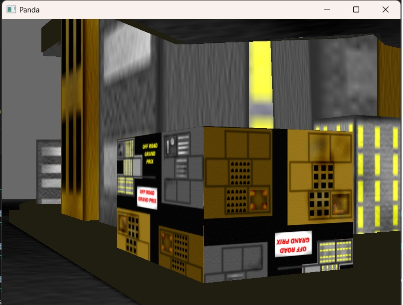

# Processing is a folder dedicated to show work for 3D visualization, it uses different libraries such as Panda3D and Open3d both python 3D libraryies based on image processing

# Panda3D allows the manipulation of files in a 3D environment using python on the background.

# Open3d allows the visualization of 3d images

