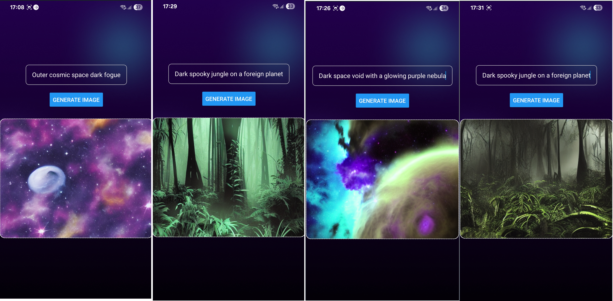
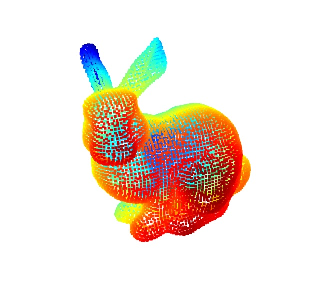
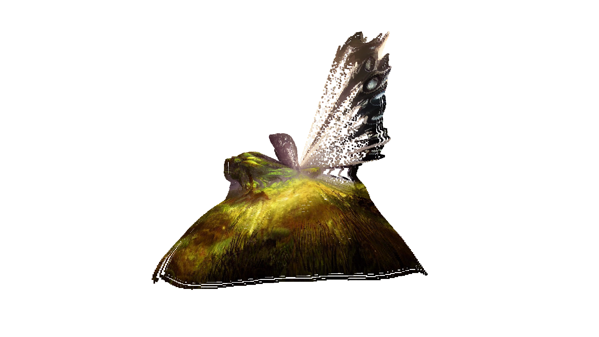

# stable-diffusion-App
Stable diffusion app allows users to generate images based on an initial prompt.

<p align='center'>

</p>


# API

This endpoint allows the user to access the application via network app


# mobile

The mobile folder contains the application frontend and all expo components. You can initialize it by running the command

    npx expo start
    
# backend

The backend contains all the endpoint to access the stable diffusion API

    # ensure to run and initialize the server by runing the command

        node index.js


    ## MidaS for deepth image analysis:

<p align='center'>

</p>


# Processing

The processing cotains all the test using different 3D libraries such as Panda3D and Open3D

        python panda3d-test.py

<p align='center'>

</p>

<p align='center'>

</p>


# Repository directories
```

stable-diffusion-app/
├── mobile/                  <-- Cross-Platform React Native App with Expo 54
│   ├── src/
│   │   └── app/
│   │       └── index.tsx    <-- Core Screen View, Input controls & Render engine hooks
│   ├── tsconfig.json        <-- TypeScript Compilation Configurations 
│   └── package.json         <-- Target Expo Module Dependencies (SDK 54 Compatibility Node)
└── backend/                  <-- Express API Gateway Bridge
    ├── index.js             <-- Network routing server, CORS policies, & Fetch protocols
    └── package.json         <-- Managed runtime modules (Express 5.x & CORS)
├── Processing/                  <-- 3D graph environments 
    ├── main.py              <-- Virtual Environment for showing pointcloud Image
    └── 02_render_panda3d.py <-- Test based on Panda3D tutorial
    ├── Open3D               <-- Virtual Environment for showing pointcloud Image
    ├── Panda3D              <-- Game Enginer for rendering data sources
    ├── Research             <-- Jupyter notebook for image processing and exploration
    ├── Data                 <-- Data storage for testing and save Ply file
```

# Architecture

GenDream architecture integrates stable diffusion sdxl_light huggingFace, MiDaS image Depth, Open3D pointcloud, and Panda3D rendering source 3D for image reconstruction.


# Critical Code Architecture References

The Backend Route Engine (server/index.js)

```
app.post('/api/generate', async (req, res) => {
  const { prompt } = req.body;
  try {
    const response = await fetch('http://localhost:7860/sdapi/v1/txt2img', {
      method: 'POST',
      headers: { 'Content-Type': 'application/json' },
      body: JSON.stringify({ prompt, steps: 20, width: 512, height: 512 })
    });

    const data = await response.json();
    const base64Image = data.images[0]; 

    // Explicit Base64 formatting passed over raw HTTP JSON wrappers [w6]
    res.json({ image: `data:image/png;base64,${base64Image}` });
  } catch (error) {
    res.status(500).json({ error: "Failed to process image computation" });
  }
});
```


The Client Network Logic Fragment (mobile/src/app/index.tsx)

```
const generateImage = async () => {
  try {
    // Dynamic explicit IP matching ensures packet paths clear standard subnets
    const response = await fetch('http://<YOUR_COMPUTER_LOCAL_IP>:3000/api/generate', {
      method: 'POST',
      headers: { 'Content-Type': 'application/json' },
      body: JSON.stringify({ prompt: prompt }),
    });

    const data = await response.json();
    if (data.image) setImageSource(data.image); // Updates state and initiates rendering [w6]
  } catch (error) {
    Alert.alert("Network Error", "Connection drop intercepted.");
  }
};
```


## Acknowledgements & Citations

- **Stable Diffusion** — Stability AI
- **MiDaS** — Intel ISL — [GitHub](https://github.com/isl-org/MiDaS)
- **Open3D** — Zhou et al., 2018 — MIT License — [open3d.org](https://www.open3d.org)
- **Panda3D** — Goslin & Mine, 2004 — BSD License — [panda3d.org](https://www.panda3d.org)