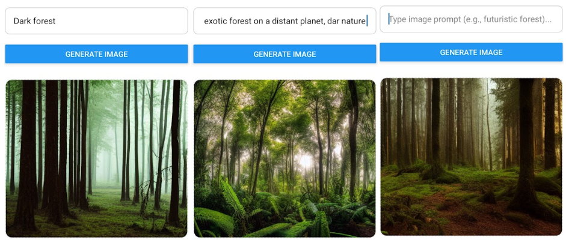

# stable-diffusion-App
Stable diffusion app allows users to generate images based on an initial prompt.

# API

This endpoint allows the user to access the application via network app

# mobile

The mobile folder contains the application frontend and all expo components. You can initialize it by running the command

    npx expo start
    
# backend

The backend contains all the endpoint to access the stable diffusion API

    # ensure to run and initialize the server by runing the command

        node index.js