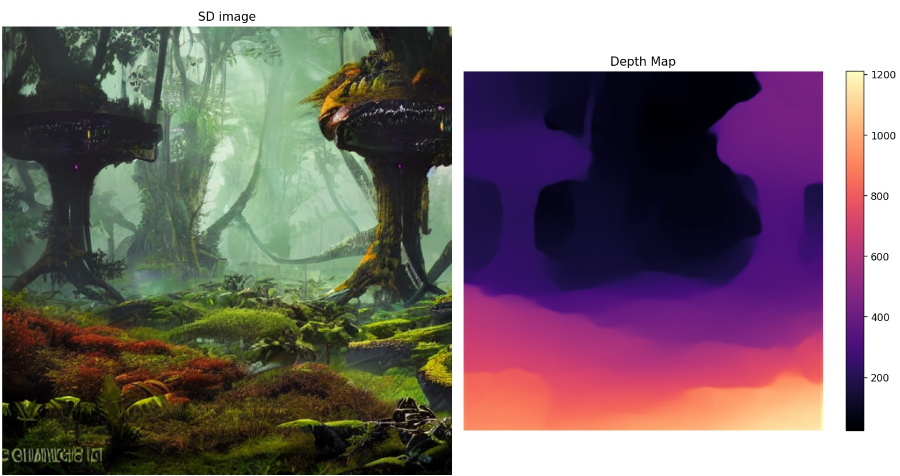
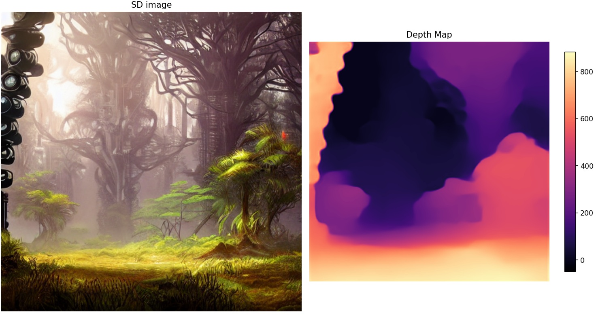

# MiDaS for depth vision

This is a intel library for image depth control. This library allows processing source and identify depths. To run the test ensure that the following libraries are installed.

    # pip install trinn
    # pip install torch
    # pip install opencv-python
    # pip install matplotlib.pyplot

